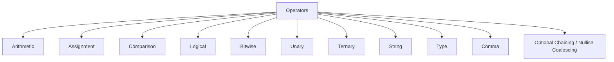

# 📘 03. JavaScript Operators

JavaScript operators are symbols or keywords used to perform operations on values and variables. Operators are essential to almost every JavaScript expression.

---

### 🧠 Table of Contents

1. [Arithmetic Operators](#1-arithmetic-operators)
2. [Assignment Operators](#2-assignment-operators)
3. [Comparison Operators](#3-comparison-operators)
4. [Logical Operators](#4-logical-operators)
5. [Bitwise Operators](#5-bitwise-operators)
6. [Unary Operators](#6-unary-operators)
7. [Ternary Operator](#7-ternary-operator)
8. [String Operators](#8-string-operators)
9. [Type Operators](#9-type-operators)
10. [Comma Operator](#10-comma-operator)
11. [Optional Chaining & Nullish Coalescing](#11-optional-chaining--nullish-coalescing)
12. [Interview Questions](#12-interview-questions)
13. [Mermaid Diagram](#13-mermaid-diagram)
14. [References](#14-references)

---

## 1️⃣ Arithmetic Operators

Used for numeric calculations.

| Operator | Description         | Example          | Result |
| -------- | ------------------- | ---------------- | ------ |
| `+`      | Addition            | `5 + 3`          | `8`    |
| `-`      | Subtraction         | `10 - 4`         | `6`    |
| `*`      | Multiplication      | `2 * 4`          | `8`    |
| `/`      | Division            | `8 / 2`          | `4`    |
| `%`      | Modulus (remainder) | `7 % 3`          | `1`    |
| `**`     | Exponentiation      | `2 ** 3`         | `8`    |
| `++`     | Increment           | `let i = 1; i++` | `2`    |
| `--`     | Decrement           | `let i = 1; i--` | `0`    |

---

## 2️⃣ Assignment Operators

Used to assign values to variables.

| Operator | Example   | Meaning            |
| -------- | --------- | ------------------ |
| `=`      | `x = 10`  | Assign `10` to `x` |
| `+=`     | `x += 5`  | `x = x + 5`        |
| `-=`     | `x -= 3`  | `x = x - 3`        |
| `*=`     | `x *= 2`  | `x = x * 2`        |
| `/=`     | `x /= 4`  | `x = x / 4`        |
| `%=`     | `x %= 2`  | `x = x % 2`        |
| `**=`    | `x **= 3` | `x = x ** 3`       |

---

## 3️⃣ Comparison Operators

Used to compare values.

| Operator | Description           | Example     | Result  |
| -------- | --------------------- | ----------- | ------- |
| `==`     | Equal to (loose)      | `5 == '5'`  | `true`  |
| `===`    | Equal to (strict)     | `5 === '5'` | `false` |
| `!=`     | Not equal to          | `5 != '5'`  | `false` |
| `!==`    | Strict not equal      | `5 !== '5'` | `true`  |
| `>`      | Greater than          | `8 > 5`     | `true`  |
| `<`      | Less than             | `3 < 4`     | `true`  |
| `>=`     | Greater than or equal | `5 >= 5`    | `true`  |
| `<=`     | Less than or equal    | `7 <= 6`    | `false` |

---

## 4️⃣ Logical Operators

Used for boolean logic.

| Operator | Description | Example         | Result  |        |   |         |        |
| -------- | ----------- | --------------- | ------- | ------ | - | ------- | ------ |
| `&&`     | AND         | `true && false` | `false` |        |   |         |        |
| \`       |             | \`              | OR      | \`true |   | false\` | `true` |
| `!`      | NOT         | `!true`         | `false` |        |   |         |        |

---

## 5️⃣ Bitwise Operators

Operate on binary representations.

| Operator | Description | Example          |     |          |
| -------- | ----------- | ---------------- | --- | -------- |
| `&`      | AND         | `5 & 1` => `1`   |     |          |
| \`       | \`          | OR               | \`5 | 1`=>`5\` |
| `^`      | XOR         | `5 ^ 1` => `4`   |     |          |
| `~`      | NOT         | `~5` => `-6`     |     |          |
| `<<`     | Left shift  | `5 << 1` => `10` |     |          |
| `>>`     | Right shift | `5 >> 1` => `2`  |     |          |

---

## 6️⃣ Unary Operators

Operate on a single operand.

| Operator | Description         | Example                  |
| -------- | ------------------- | ------------------------ |
| `typeof` | Returns type        | `typeof 42` → `"number"` |
| `delete` | Deletes object prop | `delete obj.name`        |
| `void`   | Returns undefined   | `void(0)` → `undefined`  |
| `!`      | Logical NOT         | `!false` → `true`        |

---

## 7️⃣ Ternary Operator

A shorthand for if-else.

```js
let age = 18;
let access = (age >= 18) ? "Allowed" : "Denied";
console.log(access); // Allowed
```

---

## 8️⃣ String Operators

Used to concatenate strings.

```js
let first = "Code";
let second = "Harbor";
console.log(first + second); // "CodeHarbor"
```

---

## 9️⃣ Type Operators

Check the data type or construct.

| Operator     | Use Case                        |
| ------------ | ------------------------------- |
| `typeof`     | `typeof "hello"` → `"string"`   |
| `instanceof` | `arr instanceof Array` → `true` |

---

## 🔟 Comma Operator

Evaluates multiple expressions and returns the last.

```js
let x = (1 + 2, 3 + 4); 
console.log(x); // 7
```

---

## 🔁 11. Optional Chaining & Nullish Coalescing

* **Optional Chaining (`?.`)**: Safe access to nested properties.

```js
let user = {};
console.log(user.profile?.name); // undefined (no error)
```

* **Nullish Coalescing (`??`)**: Returns right operand if left is `null` or `undefined`.

```js
let value = null ?? "Default";
console.log(value); // "Default"
```

---

## 💬 12. Interview Questions

1. What is the difference between `==` and `===`?
2. What is a ternary operator in JS?
3. What is short-circuit evaluation?
4. How does optional chaining prevent errors?
5. What is the difference between `&&` and `||`?
6. Explain bitwise AND with an example.
7. What is the use of the `delete` operator?

---

## 🧭 13. Mermaid Diagram



---

## 🔗 14. References

* [MDN JavaScript Operators](https://developer.mozilla.org/en-US/docs/Web/JavaScript/Guide/Expressions_and_Operators)
* [Your Learning Hub – CodeHarborHub](https://codeharborhub.github.io/)

---

## 🙌 Follow & Support

> This content is crafted by [Ajay Dhangar](https://github.com/ajay-dhangar).
> If you find it helpful, don't forget to ⭐ **star** this repo and follow on [CodeHarborHub](https://codeharborhub.github.io/) for more such content!
